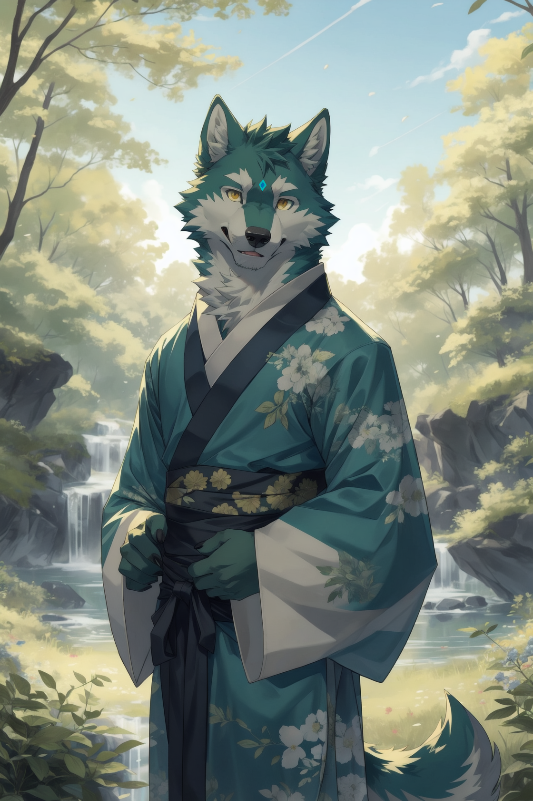
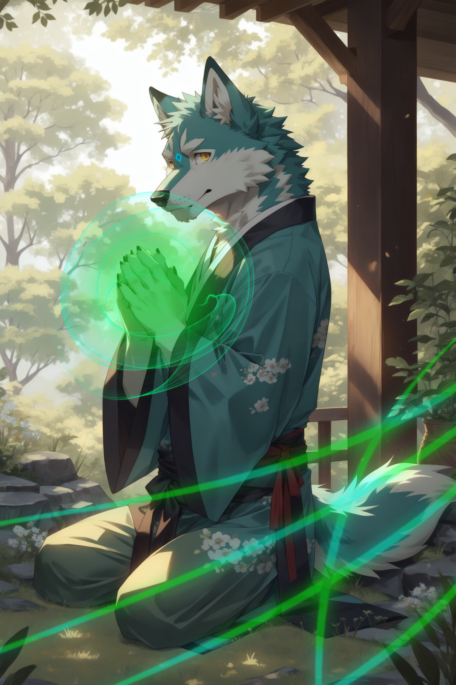

**✦✧✧Sommaire✧✧✦**

**─━─━─━─「✦」─━─━─━─**

**Sᴏᴍᴍᴀɪʀᴇ :**

**⇛Identité⇚**

**⇛Personnalité⇚**

**⇛Physique⇚**

**⇛Pouvoir⇚**

**⇛Relations⇚**

**⇛Histoire⇚**

**─━─━─━─「✦」─━─━─━─**

**┏━┅┅┄┄⟞✮⟝┄┄┉┉━┓**

**┗━┅┅┄┄⟞✮⟝┄┄┉┉━┛**

**✦✧✧Identité✧✧✦**

*Nom:*  
『✦Asakura✦』

*Prénom:*  
『✦Aoki✦』

*Âge:*  
『✦20 ans✦』

*Race:*  
『✦Loup✦』

*Genre:*  
『✦Masculin✦』

*Sexualité:*  
『✦Homosexuel✦』

**─━─━─━─「✦」─━─━─━─**

**✦✧✧Caractère✧✧✦**

『✦Aoki, un jeune homme émanant une aura de douceur et de générosité, se distingue au sein du clan Asakura en tant que guérisseur dévoué. Son tempérament harmonieux, combiné à une détermination féroce et une obstination bien ancrée, crée un équilibre unique qui caractérise son être. De taille moyenne, Aoki porte avec élégance les signes distinctifs de son clan, ses vêtements reflétant la tradition et l'histoire des Asakura, un kimono vert avec des fleurs de camomille. Ses yeux expressifs, d'un jaune étincelant dégagent une compassion sincère et une empathie innée envers ceux qui cherchent réconfort et guérison.』

『✦Doté d'un don exceptionnel pour les arts de la guérison, des poisons, et antidotes. Aoki canalise son énergie magique avec une précision minutieuse. Ses mains, délicates mais puissantes, sont les instruments par lesquels il transmet la guérison à ceux qui en ont besoin. Son savoir-faire médical et son intuition aiguisée font de lui une figure respectée au sein de la communauté Asakura.』

『✦Bien que sa nature soit empreinte de bienveillance, Aoki révèle parfois un tempérament fort et une ténacité inébranlable lorsqu'il est confronté à des défis. Sa détermination à aider les autres transcende les limites de son caractère doux, faisant de lui un pilier de soutien au sein du clan en tant qu'héritier. Il incarne la symbiose parfaite entre la force et la compassion, un guérisseur qui, malgré son tempérament têtu, offre un réconfort et une guérison inestimables à ceux qui croisent son chemin.✦』

*Rêve:*  
『✦Pouvoir guérir tout le monde✦』

*Peur:*  
『✦L'une des plus grande peur d'Aoki est sans doute de ne pas être capable de soigner et guérir les personnes qui lui sont chère✦』

*Ce qu’il aime:*  
『✦Aoki adore plus que tout la nature mais également les plantes médicinales, il aime les étudier mais aussi d'en cultiver✦』

*Ce qu’il n’aime pas:*  
『✦Aoki a peu de tolérance envers ceux qui ignorent ou négligent les principes fondamentaux de la santé et de la guérison. Il est frustré par l'ignorance médicale qui peut entraîner des souffrances inutiles.✦』

**┏━┅┅┄┄⟞✮⟝┄┄┉┉━┓**

**┗━┅┅┄┄⟞✮⟝┄┄┉┉━┛**

**─━─━─━─「✦」─━─━─━─**

**✦✧✧Physique✧✧✦**

*Couleur de peau:*  
『✦Vert et Blanche✦』

*Couleur de cheveux:*  
『✦Vert✦』

*Type de cheveux:*  
『✦Court et mêche✦』

*Couleur des yeux:*  
『✦Jaune✦』

*Morphologie:*  
『✦Aoki est assez musclé et fin✦』

*Santé:*  
『✦Même si Aoki préfère s'occuper de se préoccuper de la santé des autres, il veille à ce qu'il soit toujours en bonne forme pour soigner tout le monde.✦』

**┏━┅┅┄┄⟞✮⟝┄┄┉┉━┓**

**┗━┅┅┄┄⟞✮⟝┄┄┉┉━┛**

**─━─━─━─「✦」─━─━─━─**

**✦✧✧Magie✧✧✦**

*Nom du pouvoir n°1:*  
『✦Éclat Vital✦』

*Conséquence du pouvoir:*  
『✦Aoki peut concentrer son énergie magique afin de pouvoir prodiguer de puissants soins envers les autres mais aussi sur lui. Cela lui permet également de pratiquer une extraction de poison sur des individus mais aussi de pouvoir analyser le corps pour connaître les blessures et autres problèmes.✦』

*Faiblesses du pouvoir:*  
『✦Ce type de magie lui demande beaucoup plus de mana que d'autres pouvoirs, ce qui l'épuise à force de soigner.✦』

*Restrictions du pouvoir:*  
『✦Généralement il lui est impossible d'utiliser cette magie lors d'un combat car cela lui demande une concentration et un usage précis de sa magie.✦』

**◆━━━━━━━━▣✦▣━━━━━━━━◆**

*Nom du pouvoir n°2:*  
『✦Éclat Nocif✦』

*Conséquence du pouvoir:*  
『✦Aoki peut créer du poison à l'aide de sa magie à partir de ses mains et il peut le recracher à partir de sa bouche comme un nuage de poison. En concentrant sa magie dans ses mains, il peut les utiliser comme un scalpel magique en les entourant de sa magie capable de détruire des muscles et autres organes d'un simple toucher et même d'insuffler un courant électrique capable de déstabiliser le système nerveux ce qui a pour effet que les membres ne bougent pas comme la personne le souhaite.✦』

*Faiblesses du pouvoir:*  
『✦Ce genre de pouvoir est utilisé de manière offensive même si cela lui demande beaucoup de mana. Le nuage de poison prend un certain temps pour se composer et être relâché. Pour ensuite perturber le système nerveux, Aoki doit placer un coup précis dans la nuque de son adversaire.✦』

*Techniques:*  
『✦Régénérescence Absolue✦』

『✦Technique ultime du clan Asakura, seules les personnes du clan ayant la faculté d'avoir une maîtrise très raffinée de sa magie en ayant une utilisation précise de son mana peuvent apprendre cette technique. Aoki a su démontrer cette maîtrise de son mana à la perfection qu'il a pu développer cette technique bien qu'il lui ait fallu 5 ans pour la maîtriser. En effet, Aoki a passé cinq ans à stocker son mana pour créer un sceau magique sur son front qui conserve tout le mana accumulé pour une utilisation postérieure, et quand le sceau est rompu, le mana stocké retourne dans le corps ce qui augmente grandement le flux de magie.』

『✦En libérant d'un seul coup une grande quantité de magie, Aoki peut l'utiliser pour stimuler la division cellulaire de force guérissant instantanément toutes ses blessures que ce soit des tissus ou des organes, c'est pourquoi tant que cette technique reste active, Aoki ne peut pas mourir.』

『✦Bien que cette technique soit sans doute l'une des plus puissantes dans la magie de guérison, la Régénérescence Absolue ne répare pas les anciennes cellules endommagées car cela consiste à accélérer la création de nouvelles cellules. Bien que cela soit très efficace, à cause de la durée de vie des cellules du corps limitée, Aoki se voit en contrepartie sa durée de vie réduite.✦』

**◆━━━━━━━━▣✦▣━━━━━━━━◆**

『✦Impact de la fleur de Camomille✦』  

『✦Cette technique est connue pour son effet dévastateur. Elle nécessite une grande concentration et un contrôle minutieux de son mana. En situation de combat, elle implique la concentration d'une quantité substantielle de mana à un emplacement précis du corps, généralement le poing, suivi d'une libération instantanée. Le mana est alors déchargé dans la cible au niveau du point d'impact. Du fait que l'énergie est canalisée sur une surface restreinte, son effet en est d'autant plus dévastateur. L'étendue des dégâts est directement proportionnelle à la quantité de mana manipulée. Un mage chevronné peut même réussir à concentrer une puissante charge énergétique dans un simple doigt.✦』

**◆━━━━━━━━▣✦▣━━━━━━━━◆**

**┏━┅┅┄┄⟞✮⟝┄┄┉┉━┓**

**┗━┅┅┄┄⟞✮⟝┄┄┉┉━┛**

**─━─━─━─「✦」─━─━─━─**

**✦✧✧Relations✧✧✦**

*Famille:*  
『✦Aoki est issu d'une famille de longue lignée de mage guérisseurs du clan Asakura qui sont très appliqués sur leur propre état de santé qu'ils vivent assez longtemps. De plus, chaque héritier du clan bénéficie des entraînements les plus rigoureux et des instructions afin d'apprendre leurs meilleures techniques de guérison.✦』

*Amis:*  
『✦Le clan Asakura a beaucoup de clients du fait qu'il ouvre leur temple au public afin de leur faire bénéficier de leurs soins. Ils possèdent une bonne réputation et clientèle que beaucoup de monde demande leur expertise et même Aoki participe aux soins des civils.✦』

*Amour:*  
『✦Aoki n'a jamais connu l'amour durant toute sa vie au vu de ses préoccupations en tant qu'héritier de son clan. Il a dû dès son plus jeune âge recevoir l'apprentissage des maîtres du clan et n'a pas eu le temps de se consacrer à ses relations amoureuses.✦』

*Ennemis:*  
『✦Aoki a très peu d'ennemis du fait qu'il aide beaucoup de personnes, bien que le milieu médical soit assez difficile et que parfois certains patients sont contre le clan pour des raisons inconnues.✦』

**─━─━─━─「✦」─━─━─━─**

**✦✧✧Histoire✧✧✦**  

『✦Dans un lointain village, niché au cœur de vastes étendues verdoyantes, Aoki a vu le jour en tant qu'héritier unique du prestigieux clan Asakura, réputé dans tout le pays pour ses prodigieux pouvoirs de guérison. Le clan Asakura était depuis des générations composé d'innombrables guérisseurs ayant percé les mystères ancestraux de la magie de la guérison, une lignée de mages respectés et admirés pour leur capacité à apaiser les maux du corps et de l'esprit.』

『✦Dès son plus jeune âge, Aoki a été initié aux arts sacrés de la guérison par les sages et les guérisseurs éminents de son clan. Son lien avec la magie était inné, une affinité profonde qui lui a valu une attention particulière au sein de sa communauté. Tandis que d'autres enfants jouaient, Aoki étudiait les propriétés curatives des plantes, maîtrisait les rituels de guérison, et développait une maîtrise précise de son mana, une aptitude rare même parmi les membres de son clan qu'il a dû accumuler pendant cinq ans du mana pour son entraînement.』

『✦À mesure qu'il grandissait, Aoki est devenu l'un des guérisseurs les plus puissants. Guidé par la sagesse des anciens et la bienveillance de sa famille, Aoki se plongea profondément dans l'étude des arts de la guérison, aspirant à dépasser les exploits déjà légendaires de ses prédécesseurs.』

『✦Le passé d'Aoki était loin d'être ordinaire. Il n'avait jamais connu une enfance semblable à celle des autres enfants, car dès son plus jeune âge, il dut se consacrer à des études rigoureuses et intensives. Ces années d'apprentissage précoce forgèrent non seulement sa maîtrise exceptionnelle du mana, mais aussi sa connaissance de techniques uniques de son clan transmises de génération en génération, dont la "Régénérescence Absolue".』

『✦La "Régénérescence Absolue" était une pratique considérée comme interdite en raison de son potentiel risque élevé lors de son utilisation. Cette technique puissante permettait à Aoki de restaurer la vie même dans les cas les plus désespérés. Malgré l'interdiction imposée par les autorités, le clan Asakura a pu obtenir l'autorisation de son utilisation uniquement sous les règles des préceptes érigés par le clan pour tous les guérisseurs du clan.✦』