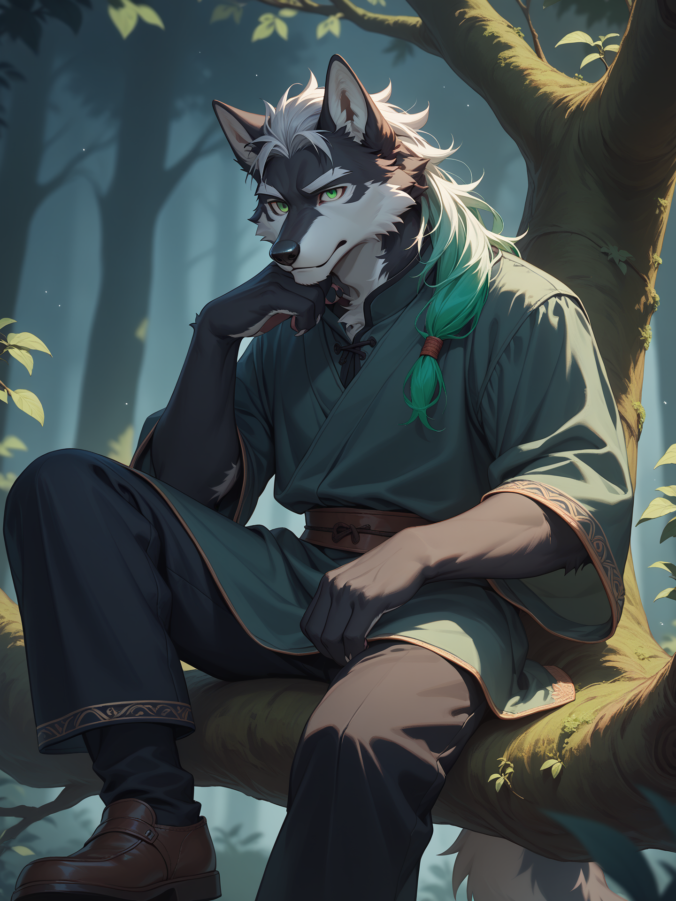

***
╔═══❖•ೋ° °ೋ•❖═══╗
***
***
꧁§༺⚔Wayke/Kyle⚔༻§꧂
***
***
╚═══❖•ೋ° °ೋ•❖═══╝
***

*__
"Chaque coup porté aux ténèbres laisse une cicatrice dans mon âme."
__*

***
➢ Nom
***

*
Le nom Wayke fait référence au mot "Wake" en anglais qui signifie "Se réveiller" ou "S'éveiller". C'est une allusion à sa propre renaissance après avoir passer dans le monde des ombres et revenu à la vie
*

***
➢ Prénom
***

*
Kyle est un nom qui provient d'un ancien dialecte où il signifiait un canal ou quelque chose d'étroit ce qui reflète sa nature, coincé entre deux mondes.
*

***
➢ Surnom
***

*
Le Spectre Éveillé
*

***
➢ Âge.
***

*
32 ans
*

***
➢ Date de naissance
***

*
Il est né un 23 janvier
*

***
➢ Origine
***

*
Kyle était au départ un jeune adolescent qui travaillait en tant que marchand dans son village natal, avant d'avoir sa tragédie.
*

***
➢ Orientation sexuelle
***

*
Bisexuel
*

***
➢ Genre
***

*
Masculin
*

***
➢ Son rang ( civil, Royal, Etudiant etc)
***

*
Kyle est un civil, il était au départ un petit marchand dans sa ville natale
*

***
╔═══❖•ೋ° °ೋ•❖═══╗
***
***
꧁§༺⚔ Physique⚔༻§꧂
***
***
╚═══❖•ೋ° °ೋ•❖═══╝
***

***
➢ Toc (facultatif)
***

*
Aucun
*

***
➢ Son regard (doux, normal, sévère)
***

*
Kyle avait auparavant un regard joyeux reflétant sa bonne humeur mais maintenant son regard exprime une personne qui à déjà vu la mort.
*

***
➢ Sa voix (décrivez comment est sa voix)
***

*
Sa voix est plutôt calme et sérieuse. Il parle de manière réfléchit. Il ne parle rarement fort et il est particulièrement discret
*

***
➢ Ses gestes
***

*
Kyle a des gestes assez discret et simple, Bien qu'il peut parfois utiliser ses mains lorsqu'il parle avec son passé de marchand.
*

***
➢ Son poids
***

*
Il pèse actuellement 65Kg, Il est un peu musclé, bien qu'il n'a pas effectuer d'entrainement pour entretenir son corps.
*

***
➢ Sa taille
***

*
Kyle mesure 1m70.
*

***
➢ La couleur des cheveux
***

*
Ses cheveux son d'une couleur assez particulière, auparavant ses cheveux était noir mais maintenant il sont devenu argenté avec un reflet vert.
*

***
➢ Type de cheveux
***

*
Ses cheveux sont assez long et il les dispose en mèche
*

***
➢ La couleur des yeux
***

*
Ses yeux sont de couleur verte émeraude
*

***
➢ La taille de ses mains
***

*
Ses mains ressemble à ceux d'un humain bien qu'il soit différent du à sa nature
*

***
➢ Cicatrice(s)/blessure(s)
***

*
Kyle possède une cicatrice sur son torse au niveau de son cœur qui ressemble à une fissure.
*

***
➢ Bijou(x)
***

*
Il ne porte aucun bijoux.
*

***
➢ Son corps
***

*
Kyle à un corps assez fin avec une légère musculations, Il porte des habits assez simple et confortable.
*

***
╔═══❖•ೋ° °ೋ•❖═══╗
***
***
꧁§༺⚔ Caractère ⚔༻§꧂
***
***
╚═══❖•ೋ° °ೋ•❖═══╝
***

__*
"Je suis la lueur vacillante dans l'obscurité….. Celle qui refuse de s'éteindre."
*__

***
➢ Décrivez le caractère du OC
***

*
Kyle est une personne réfléchi, profond, et tourmenté par sa double nature. Il est calme et mesuré, mais sa malédiction a laissé des cicatrices profondes qui affectent sa perception de lui-même et des autres. Courageux et déterminé, il est toujours prêt à se sacrifier pour protéger les innocents, mais il lutte constamment contre l'obscurité qui habite en lui. Il fait preuve d’une grande maturité forgée par les épreuves, et a un sens aigu de la justice.
*

***
➢ Ce qu'il/elle déteste
***

*
Kyle déteste les créatures des ombres et toute forme d'injustice. Il déteste également son propre sentiment d'impuissance mais également de devoir lutter contre lui-même.
*

***
➢ Ce qu'il/elle n'aime pas
***

*
Kyle n'aime pas les situations où il doit abandonner les autres ou laisser des innocents derrière lui, même s'il comprend parfois que c'est inévitable. Il n’aime pas non plus l’obscurité totale, symbole de son traumatisme et des ombres qui le hantent.
*

***
➢ Ce qu'il/aime
***

*
Kyle préfère la tranquillité et les moments de répit entre les batailles.
*

***
➢ Ce qu'il/elle adore
***

*
Kyle adore la lumière de la pleine lune, car elle est pour lui un symbole de renouveau et de protection contre les ténèbres.
*

***
➢ Ses qualités
***

*
Résilient, Réfléchi, Calme et Altruiste.
*

***
➢ Ses défauts
***

*
Solitaire, Tourmenté et Têtu
*

***
➢ Traumatisme psychologique
***

*
yle a subi un profond traumatisme lors de son adolescence, tourmenté par sa malédiction et des ténèbres en lui, il ne supporterait plus de voir son âme piéger une fois de plus.
*

***
╔═══❖•ೋ° °ೋ•❖═══╗
***
***
꧁§༺⚔ Loisirs ⚔༻§꧂
***
***
╚═══❖•ೋ° °ೋ•❖═══╝
***

*__
"Je chasse les ténèbres, mais elles ne me lâchent jamais."
__*

***
➢ Ce qu'il/elle aime faire
***

*
Kyle aime généralement le nuit et il aime se promener dehors sous la lueur de la lune.
*

***
➢ Ce qu'il/aime pas faire
***

*
il n'aime pas révéler ses émotions ou ses peurs, car il préfère affronter ses tourments en silence.
*

***
╔═══❖•ೋ° °ೋ•❖═══╗
***
***
꧁§༺⚔ Compétences et Pouvoir ⚔༻§꧂
***
***
╚═══❖•ೋ° °ೋ•❖═══╝
***

*
➢ La bonté
*
*
[7/10]
*

*
➢ Agilité
*
*
[9/10]
*

*
➢ Charisme
*
*
[3/10]
*

*
➢ Force
*
*
[6/10]
*

*
➢ Amour
*
*
[3/10]
*

*
➢ Amitié
*
*
[4/10]
*

*
➢ Assiduité
*
*
[10/10]
*

*
➢ Loyauté
*
*
[9/10]
*

*
Pouvoir
*

**__
Purge de Ténèbres
__**
*
En raison de sa malédiction, Kyle peut absorber l'essence des ombres et des créatures qu’il combat. Cela renforce temporairement ses capacités.
*

**__
Obscurité Lumineuses
__**

*
Kyle possède un arc forgé dans un matériau rare qui canalise son âme. Il peut créer des flèches de lumière et d'ombres pure capables de soigner ses alliés ou de percer ses ennemis. Ces flèches ne nécessitent pas de projectiles physiques et apparaissent dès qu'il bande son arc.
*

**__
Voile des Ombres
__**
*
Kyle peut se transformer en une forme spectrale dû à sa malédiction. Sous cette forme, il est partiellement intangible et peut se déplacer plus rapidement mais il peut aussi camoufler des personnes dans une zone proche autour de lui.
*

**__
Étreinte de la nuit
__**
*
Kyle peut manipuler les ombres autour de lui pour attraper une personne afin de l'immobiliser
*

*
Limite du pouvoir/faiblesse.
*

**__
Purge de Ténèbres
__**
*
Kyle peut uniquement absorber l'essence des ombres sur une personnes uniquement si il la toucher avec une attaques
*

**__
Obscurité Lumineuses
__**
*
Utiliser son pouvoir pour guérir ou protéger les autres exige une énorme concentration mentale. Plus il utilise ce pouvoir, plus il s'affaiblit physiquement et mentalement, ce qui peut limiter son efficacité en combat si les ressources de son esprit sont épuisées.
*

**__
Voile des Ombres
__**
*
Lorsqu’il se transforme en spectre, Kyle devient intangible, mais cette forme est extrêmement sensible à la lumière intense. Une lumière trop puissante peut annuler la transformation en cette forme
*

**__
Étreinte de la nuit
__**
*
Il peut uniquement utilisé ce pouvoir si il y a la présence d'ombres et dans des espaces peu éclairé.
*

***
╔═══❖•ೋ° °ೋ•❖═══╗
***
***
꧁§༺⚔Famille⚔༻§꧂
***
***
╚═══❖•ೋ° °ೋ•❖═══╝
***

*
➢ Père
*

*
Son père était un marchand et il enseigner à Kyle la base des négociations et l'aptitude à mettre en valeur des produits, Bien que son père soit mort aujourd'hui.
*

*
➢ Mère
*

*
///
*

*
➢ Frère(s)
*

*
Aucun
*

*
➢ Soeur(s)
*

*
Aucune
*

*
➢ En couple ou marié avec
*

*
///
*

*
➢ Enfant(s)
*

*
Aucun
*

***
╔═══❖•ೋ° °ೋ•❖═══╗
***
***
꧁§༺⚔ Histoire ⚔༻§꧂
***
***
╚═══❖•ೋ° °ೋ•❖═══╝
***

*
Kyle était un jeune adolescent qui travaillait en tant que marchand dans son village natal. Hélas, ce n’était que jusqu’à ce qu'un événement change le cours de sa vie. Lors d’une nuit de pleine lune, un naufrage eut lieu sur la mer près de son village, libérant quelque chose d’horrible
*

*
Lorsque Kyle aperçut le bateau échoué, il s'en approcha pour voir s'il y avait des survivants, mais aucun signe de vie n'était présent. Pendant son inspection, une lance venue de la noirceur de la mer transperça son cœur. Criant de douleur, il eut une vision de son âme arrachée par une force ténébreuse avant de remarquer qu’il n’avait en réalité subi aucune blessure et que la lance avait mystérieusement disparu. À cet instant, il pensa que tout ceci n’était qu’une illusion. Cependant, Kyle avait été maudit par une puissance surnaturelle inconnue.
*

*
Le village commença à être englouti par une obscurité totale. Des ombres surgirent des profondeurs de la nuit pour s’emparer de toute forme de vie. Des cris étouffés par la nuit retentissaient dans tout le village, donnant naissance à des créatures de l’ombre qui cherchaient à plonger le monde dans les ténèbres. Alors que les villageois fuyaient pour échapper à l’obscurité, Kyle entendit des murmures l’appelant depuis une ruelle sombre, faiblement illuminée par la pleine lune. Voulant inspecter, il renonça après avoir remarqué que les ombres s’approchaient de lui à une vitesse effrayante, comme si elles étaient attirées par lui. Elles l’entourèrent avant de progressivement l’engloutir, corps et âme, tandis qu’il ressentait les douleurs et les cris des personnes transformées. Kyle savait que sa fin était proche, criant de toutes ses forces pour exprimer son dernier souffle de vie.
*

*
C’est alors qu'un rayon venu de la lune s’abattit sur lui, le libérant de l’emprise des ombres qui avaient commencé à l’engloutir. Ne comprenant pas ce qu’il venait de vivre, il sentit une main l’agripper pour l’emmener. Il ne savait pas qui était cette personne ni d’où elle venait, mais il remarqua son accoutrement : une cape et une capuche ornées de motifs représentant les différentes phases de la lune, avec une allusion à une éclipse lunaire. L’individu emmena Kyle à travers le village, se défendant contre les ombres avec deux dagues étranges, forgées dans une lourde pierre blanche qui luisait dans la nuit. Une fois sorti du village, Kyle observa l’état sombre, ténébreux et froid dans lequel son village bien-aimé avait sombré.
*

*
La plupart des survivants ne savaient plus où aller, tout comme Kyle, qui avait perdu sa routine de vie. Quant à son sauveur, il s’assura que tout le monde allait bien avant de se présenter : il se nommait Arold et était un guerrier luttant contre les ombres maudites, disait-il. Il commença alors à reprendre sa route vers une destination qu'il avait déjà planifiée. Mais Kyle eut subitement une autre vision, où il voyait les ombres devenir plus puissantes et féroces, ainsi qu'une silhouette prête à le tuer. Revenant à lui, il ne comprenait pas ce qui se passait. Le guerrier avait observé la scène et savait ce que Kyle traversait. Il lui proposa de l’accompagner dans son périple pour l’aider à vaincre ces créatures. Kyle accepta, et ils partirent vers d’autres villages envahis par les ombres.
*

*
Après plusieurs voyages à travers le monde, Kyle devint le disciple d’Arold et un guerrier de l’éclipse lunaire à l'âge de 20 ans, se battant contre sa propre malédiction. Après son rite de bénédiction, il reçut en cadeau un arc lié à lui, forgé en pierre de lune, un matériau rare capable de canaliser l'âme de son porteur en une lumière dévastatrice. Dans le cas de Kyle, son arc pouvait générer des flèches de lumière perforantes. Kyle participa à plusieurs missions pour chasser les ombres qui tourmentaient certains villages, cherchant à en apprendre plus sur l'origine de ce mal étrange.
*

*
Lors d'une mission, ils entendirent une rumeur évoquant une créature voleuse d’âmes dans le village natal de Kyle. Une fois sur place, Kyle et son maître firent face à un monstre capable de manipuler les ombres et de capturer les âmes des vivants pour les enfermer dans un réceptacle. Après avoir ordonné l'attaque contre les guerriers, un long et difficile combat s'ensuivit. Une des créatures toucha Kyle, qui eut une vision de son maître se faisant arracher son âme par le gardien.
*

*
Kyle voulut absolument éviter ce pire scénario, et voyant que les mêmes conditions que dans sa vision se reproduisaient, il se précipita pour pousser Arold afin de le sauver d’une mort certaine. Malheureusement, les étreintes ténébreuses l’attrapèrent, et son âme fut absorbée par le réceptacle du gardien. Dans son dernier souffle, il cria à son maître de fuir avant que son corps ne soit vidé de son âme et consumé par les ombres.
*

*
Piégé dans la lanterne, Kyle explora sa prison. Il y vit plusieurs autres âmes errer frénétiquement en quête de libération. Son âme brillait plus que les autres, révélant l'éclat de vie qui l’animait encore. Il apprit que depuis le naufrage, la lance qui l’avait transpercé portait en elle une âme puissante, lui conférant une vie contre nature.
*

***__
"Les ombres s'accrochaient à la vie."
__***

*
Kyle réalisa qu'il pouvait utiliser cette force pour absorber les ombres et devenir suffisamment fort pour libérer les âmes des habitants de son village, prisonnières dans la lanterne. Parmi les âmes qu'il libéra, il retrouva d’anciens guerriers qui détenaient un immense savoir sur l'origine des ombres et sa malédiction.
*

*
Plusieurs mois plus tard, Arold revint pour sauver Kyle de l’emprise de la créature. Lors de la bataille, le guerrier fut gravement blessé par la faux que le gardien maniait. Au moment où il allait porter le coup fatal à Arold, celui-ci, en dernier recours, canalisa son énergie et planta sa dague dans le réceptacle, le faisant exploser et libérant toutes les âmes capturées.
*

*
Kyle s’échappa, enveloppé par les ombres qu'il avait puisées dans les autres âmes. Grâce à sa malédiction, il était à la fois mort et vivant. Il portait un arc reforgé à partir des armes des guerriers déchus, capable de canaliser aussi bien les ténèbres que la lumière. Arold, grièvement blessé, n’en croyait pas ses yeux de voir Kyle debout. Kyle banda son arc, canalisa son âme et tira une flèche de lumière sur Arold.
*

*
La flèche de lumière traversa le corps d’Arold, soignant ses blessures et lui conférant un bouclier protecteur contre une attaque de Serox venue de l’arrière. Tandis que le réceptacle du gardien commençait à se reconstruire, les ombres furent absorbées, ainsi que Kyle, qui n’avait plus la force de rester debout. Mais Arold le soutint fermement pour l’empêcher de retourner dans sa prison, sacrifiant ainsi sa propre vie.
*

*
Depuis ce jour, Kyle ne fuit plus les ombres. Il est capable de comprendre la souffrance des âmes qui le composent. Insensible à la douleur, il peut absorber les ombres des âmes pour les libérer et combattre le mal par le mal. Kyle accepte sa mort à chaque fois qu'il se transforme en spectre, devançant ainsi la chose même qu'il a toujours combattue, jusqu'à ce que la vie issue de sa malédiction le fasse renaître.
*
