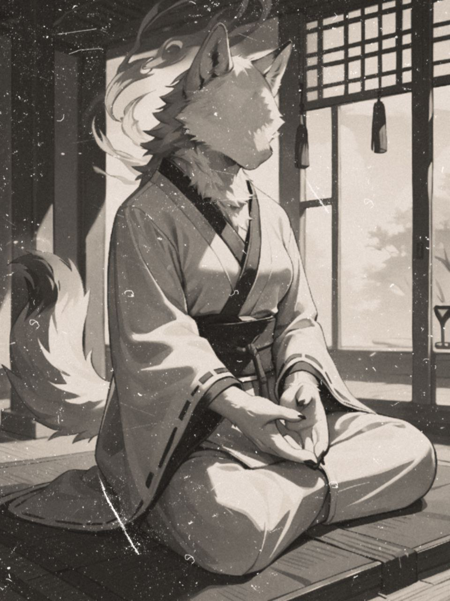
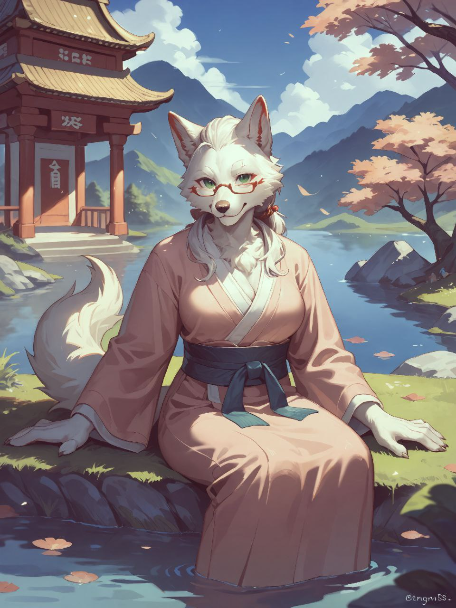

**__
✦✧✧Sommaire✧✧✦
__**

**
─━─━─━─「✦」─━─━─━─
**

__**
Sᴏᴍᴍᴀɪʀᴇ :
**__

**__
⇛Identité⇚
__**

**__
⇛Personnalité⇚
__**

**__
⇛Physique⇚
__**

**__
⇛Pouvoir⇚
__**

**__
⇛Relations⇚
__**

**__
⇛Histoire⇚
__**

**
─━─━─━─「✦」─━─━─━─
**

**
┏━┅┅┄┄⟞✮⟝┄┄┉┉━┓
**

**
┗━┅┅┄┄⟞✮⟝┄┄┉┉━┛
**

**__
✦✧✧Identité✧✧✦
__**

__
Nom:
__

『✦Son nom est Aokami (青神) ou 'Déesse Azur' est le nom de la fondatrice du royaume d'Aokami mais aussi de la famille royale en l'honneur de son héritage spitiruel✦』

__
Prénom:
__

『✦Il s'appelle Rei (怜) qui signifie 'Sagacité' un prénom court mais puissant qui reflète son potentiel avec une forte capacité spirituelle.✦』

__
Âge:
__

『✦Rei à actuellement 16 ans✦』

__
Race:
__

『✦Loup✦』

__
Genre:
__

『✦Masculin✦』

__
Sexualité:
__

『✦Bisexuel✦』

**
─━─━─━─「✦」─━─━─━─
**

**__
✦✧✧Caractère✧✧✦
__**

『✦Rei est un prince avec un caractère doux mais aussi enjoué, il sait que sa famille est l'une des plus puissante au sein du royaume et qu'il est l'héritier de la famille royale, en tant que prince il met un point sur son honneur à poursuivre la volonté de sa famille et de son héritage. Étant l'oracle de la famille selon les tradition quand un prince atteint l'âge de 16 ans il entreprend son apprentissage en effectuant des cérémonie et des rituel pour le peuple afin de mieux approfondir son pouvoir de médium. Bien qu'il soit jeune il peut parfois se montrer hautain étant le petit prince héritier qu'il a tendance à prendre de haut les citoyen du Royaume, bien que évidemment il reste un enfant naïf et innocent par son attitude✦』

__
Rêve:
__

『✦Devenir un grand médium et un Roi comme son père✦』

__
Peur:
__

『✦Ne pas de ne pas être à la hauteur des attentes de sa familles et de son royaume✦』

__
Ce qu’il aime:
__

『✦Sa famille et son titre de Prince✦』

__
Ce qu’il aime pas:
__

『✦De perdre le contrôle de ses pouvoirs✦』

**
┏━┅┅┄┄⟞✮⟝┄┄┉┉━┓
**

**
┗━┅┅┄┄⟞✮⟝┄┄┉┉━┛
**

**
─━─━─━─「✦」─━─━─━─
**

**__
✦✧✧Physique✧✧✦
__**

__
Couleur de peau:
__

『✦Blanche✦』

__
Couleur de cheveux:
__

『✦Blanche✦』

__
Type de cheveux:
__

『✦Court✦』

__
Couleur des yeux:
__

『✦Vert✦』

__
Morphologie:
__

『✦Fine✦』

__
Santé:
__

『✦En bonne santé✦』

**
┏━┅┅┄┄⟞✮⟝┄┄┉┉━┓
**

**
┗━┅┅┄┄⟞✮⟝┄┄┉┉━┛
**

**
─━─━─━─「✦」─━─━─━─
**

**__
✦✧✧Pouvoirs✧✧✦
__**

__
Techniques
__

『✦Serrures du Psyché✦』

『✦Miroir des Âmes✦』

『✦Écho du Passé✦』

『✦Larme du Voile✦』

『✦Fils de l'Âme✦』

『✦Transfusion Spirituelle✦』

**
┏━┅┅┄┄⟞✮⟝┄┄┉┉━┓
**

**
┗━┅┅┄┄⟞✮⟝┄┄┉┉━┛
**

**
─━─━─━─「✦」─━─━─━─
**

**__
✦✧✧Relations✧✧✦
__**

__
Famille:
__

『✦Ryu est issue d'une longue ligné Royale de médium, Il vit dans le Royaume accompagné de son père, sa mère et son servant. Auparavant à son plus jeune âge, il à perdu sa grand-mère mais aussi son oncle dans un tragique accident.✦』

__
Amis:
__

『✦Il n'a pas vraiment d'amis, beaucoup d'autre enfant le vénère et d'autre l'évite du à son statut, même si Ryu voudrait avoir au moins un véritable amis dans sa vie même si il se doute que du à son statut de Prince, il n'aurait pas le temps de jouer avec eux.✦』

__
Amour:
__

『✦Étant le seul héritier de la famille, il est destiné à être issue d'un mariage afin de prolongé la lignée de sa famille bien que l'amour est une chose qu'il ne le préoccupe pas✦』

__
Autres:
__

『✦Ryu possède un servant personnel sous la demande du Roi qu'il l'accompagne partout ou il va afin d'assurer de sa sécurité au sein du royaume et de son apprentissage.✦』

**
┏━┅┅┄┄⟞✮⟝┄┄┉┉━┓
**

**
┗━┅┅┄┄⟞✮⟝┄┄┉┉━┛
**

**
─━─━─━─「✦」─━─━─━─
**

**__
✦✧✧Histoire✧✧✦
__**

*
『✦Là où la mort n'est pas une fatalité, le royaume d'Aokami est un village reculé, niché loin de la cité. Bien que la technologie ait évolué au fil des années, le royaume d'Aokami n'a pas bénéficié de ces avancées. Au contraire, ils ont limité leurs échanges et préfèrent rester dans une ère ancienne qu'ils jugent plus favorable.
*

*
Tout commence avec la fondation du royaume. Une femme nommée "La Mystique Éternelle" s'échappe de son village natal, fuyant une guerre de territoire menée par une famille rivale cherchant à s'approprier les pouvoirs de la famille Aokami. Selon certaines légendes, cette famille aurait obtenu un don de la déesse divine "Azura", surnommée "La Déesse Azur", et portant le nom d'Aokami. En reconnaissance du pouvoir qu'elle avait reçu, la famille royale décide de porter le nom de la déesse et de transmettre ses traditions à travers les générations.
*

*
"La Mystique Éternelle" se réfugie alors dans un village isolé, à l'abri de ses ennemis, qui la croient disparue à jamais. Ils pensent que la famille Aokami a été anéantie, mais la Mystique Éternelle, croyant sa famille détruite, utilise ses pouvoirs pour invoquer les esprits de ses ancêtres afin de les appeler à l'aide. Les villageois, émerveillés par ses capacités spirituelles, la considèrent comme une prêtresse divine, envoyée des cieux. Ils lui demandent de les aider à entrer en contact avec leurs proches défunts, ce qu'elle accepte, même pour un instant fugace.
*

*
Au fil des ans, le petit village se développe et se transforme en un royaume prospère, portant le nom d'Aokami en l'honneur de la déesse. La Mystique Éternelle, devenue la fondatrice, en devient la Reine et instaure une règle sacrée : seuls les membres de la famille royale possédant les dons spirituels d'Aokami peuvent accéder au trône et gouverner.
*

*
Elle met au monde une fille, Sayuri Aokami, héritière de la lignée royale. Sayuri hérite également des dons spirituels de sa mère et consacre sa jeunesse à l'apprentissage de ses capacités pour devenir un jour la prochaine Reine du royaume.
*

*
Lors du couronnement de la princesse Sayuri, "La Mystique Éternelle" décide d’imposer une règle sacrée concernant l'usage de ses pouvoirs spirituels. Elle demande, en tant que dernière volonté, que son nom et son visage restent inconnus de tous. Ainsi, après sa mort, plus personne, à l'exception de la famille royale, ne connaît son vrai nom ni son visage. Elle demeure une figure sans visage, vénérée sous le nom de "La Mystique Éternelle".
*

*
Sayuri met au monde deux fils : l'aîné Ryuji Aokami et le cadet Itsuki Aokami.
*

*
Conformément à la tradition, les deux princes suivent un cheminement spirituel pour apprendre les rituels et techniques de la fondatrice avant de succéder au trône. Malheureusement, à l'âge de 16 ans, au moment où les deux princes se préparent pour leur couronnement, un accident tragique survient. Itsuki Aokami, désireux de prouver ses pouvoirs spirituels, tente de pratiquer une technique interdite de Transfusion Spirituelle, autorisée uniquement lorsque l'héritier atteint l'âge de 20 ans. Cette pratique interdite provoque des conséquences graves : un incendie dévastateur qui coûte la vie à Sayuri Aokami et à son fils Itsuki, ne laissant que Ryuji comme seul prince héritier.
*

*
Ryuji, bien qu'il ait été couronné dans des circonstances tragiques, devient le roi du royaume à l'âge de 20 ans. Son courage et sa résilience redonnent de l'espoir au peuple, et il leur montre que la mort n'est pas une fatalité dans ce royaume.
*

*
Des années plus tard, à l'âge de 36 ans, Ryuji épouse Yuriko, qui devient la Reine par alliance. Ensemble, ils donnent naissance à un nouveau prince héritier, Rei Aokami.
*

*
Rei, héritier du royaume et des pouvoirs spirituels, devient rapidement populaire au sein du royaume. Après la tragédie qu'a connue sa famille, il incarne l'espoir et la continuité des traditions. Il est vu comme le garant de l'avenir spirituel du royaume.
*

*
À 16 ans, Rei devient officiellement l'Oracle du royaume, débutant ainsi la pratique des rituels et cérémonies au service du peuple. Sous la surveillance de son serviteur personnel, Seiji, désigné par le Roi en raison des événements tragiques passés, Rei reste principalement confiné au domaine de la famille royale. Il n'a donc qu'une connaissance limitée du monde extérieur.
*

*
Mais il y a des rumeurs sur le royaume concernant l'incendie, qu'une histoire sombre se cache derrière les apparences…✦』
*

**
─━─━─━─「✦」─━─━─━─
**
