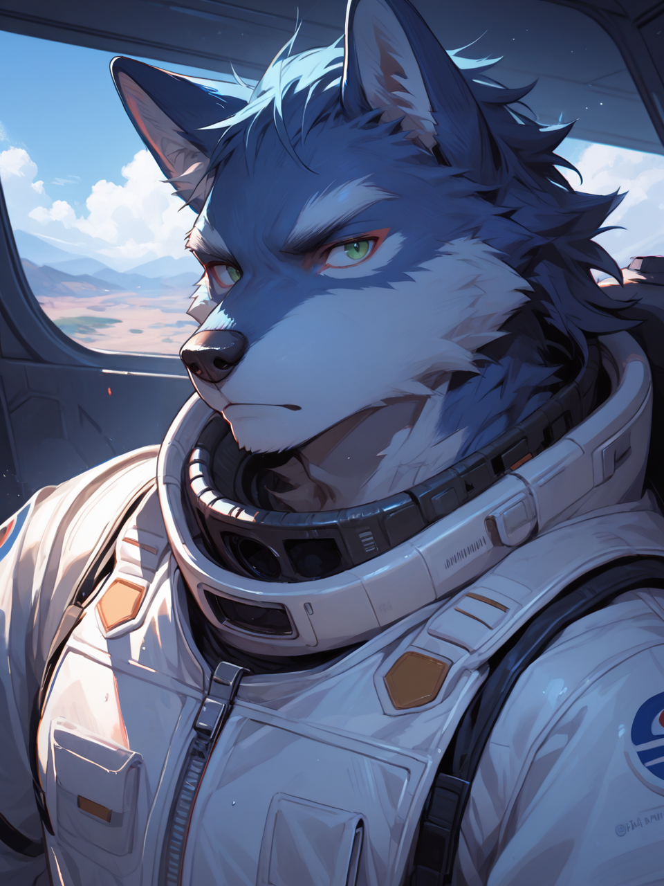
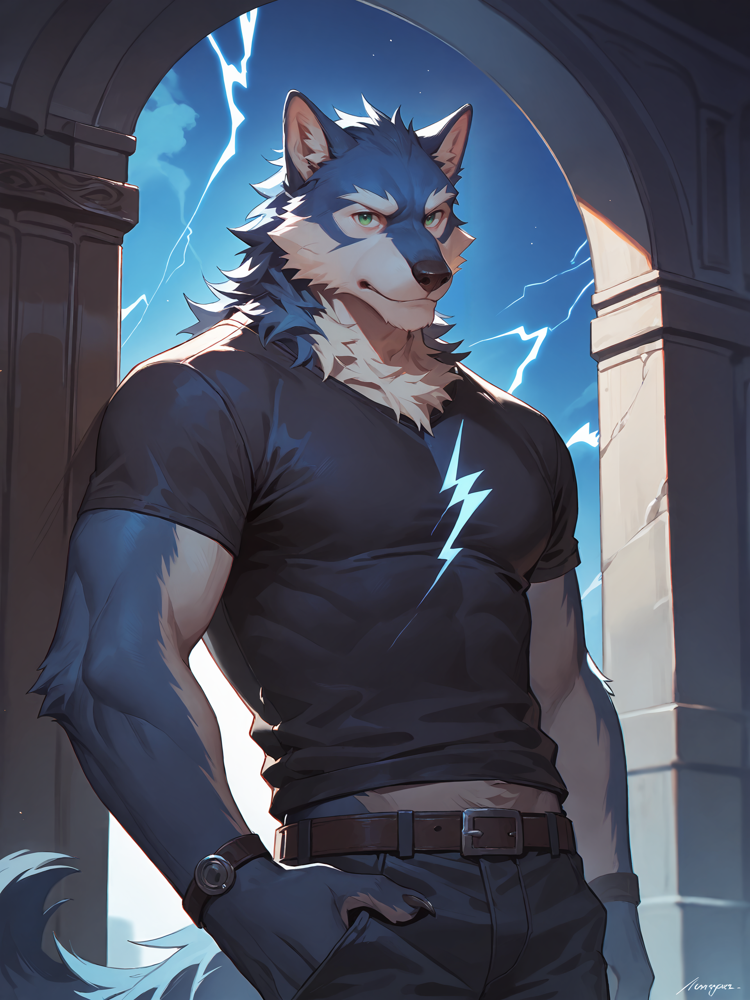
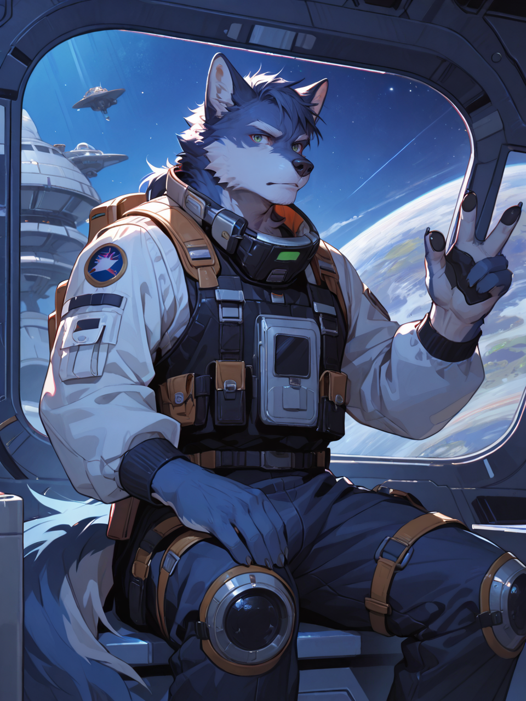
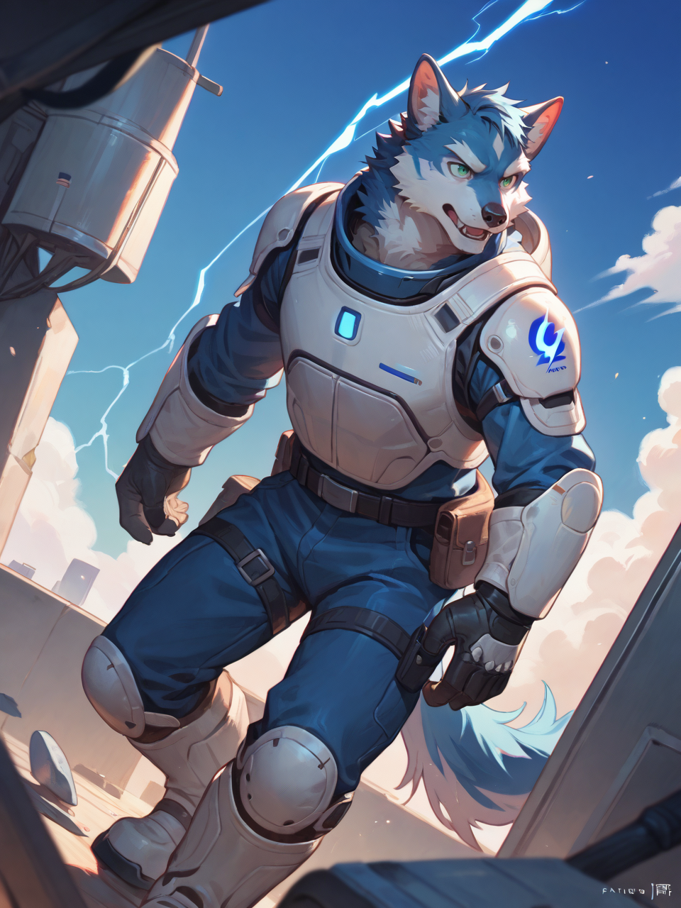
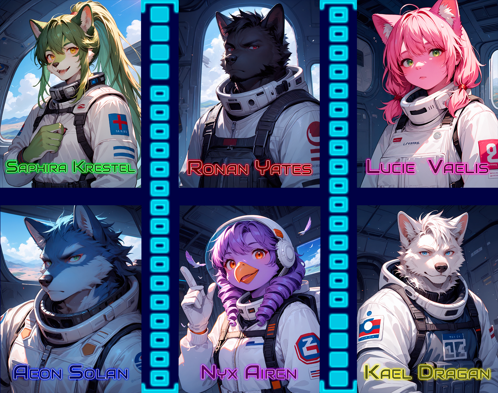

✦✧✧Sommaire✧✧✦

─━─━─━─「✦」─━─━─━─

Sᴏᴍᴍᴀɪʀᴇ :

⇛Identité⇚

⇛Personnalité⇚

⇛Physique⇚

⇛Pouvoir⇚

⇛Relations⇚

⇛Histoire⇚

─━─━─━─「✦」─━─━─━─

┏━┅┅┄┄⟞✮⟝┄┄┉┉━┓

┗━┅┅┄┄⟞✮⟝┄┄┉┉━┛

✦✧✧Identité✧✧✦

Nom:

『✦Solan✦』

Prénom:

『✦Aeon✦』

Âge:

『✦28 ans✦』

Race:

『✦Furry (Loup)✦』

Genre:

『✦Masculin✦』

Sexualité:

『✦Bisexuel✦』

─━─━─━─「✦」─━─━─━─

✦✧✧Caractère✧✧✦

『✦Doté d'une intelligence intuitive et d'une grande maîtrise de ses connaissances, Aeon Solan s'est rapidement imposé comme un prodige dans l'étude des exoplanètes et de leurs formes de vie. Passionné et méthodique, il aborde chaque découverte avec une rigueur scientifique qui ne laisse aucune place à l'incertitude!;

D’un naturel sérieux et solitaire, Aeon privilégie la précision à l’intuition et évite les décisions hasardeuses. Cette attitude, bien que précieuse dans son domaine, le fait parfois paraître distant, voire froid aux yeux de ses collègues. Il préfère la logique aux élans émotionnels et n’accorde sa confiance qu’avec le temps.

Malgré cela, lorsqu'il fut recruté pour une mission d’exploration spatiale, il se retrouva entouré d’un équipage avec lequel il allait partager des années de voyage dans l’inconnu. Peu à peu, cette équipe devint une véritable famille, lui offrant un lien qu’il n’avait jamais réellement cherché, mais qui finirait par lui manquer plus que tout.✦』

Rêve:

『✦Voyager dans l'espace✦』

Peur:

『✦Dérivé dans le vide spatial✦』

Ce qu’il aime:

『✦La génétique, la biologie, les exoplanètes✦』

Ce qu’il aime pas:

『✦La présence de beaucoup de personne et des bruits trop fort✦』

┏━┅┅┄┄⟞✮⟝┄┄┉┉━┓

┗━┅┅┄┄⟞✮⟝┄┄┉┉━┛

─━─━─━─「✦」─━─━─━─

✦✧✧Physique✧✧✦

Couleur de peau:

『✦Bleu✦』

Couleur de cheveux:

『✦Bleu✦』

Type de cheveux:

『✦Diposer en mèche sur le coté✦』

Couleur des yeux:

『✦Vert✦』

Morphologie:

『✦Assez musclé✦』

Santé:

『✦En pleine santé (Fatigué par l'hypersommeil)✦』

┏━┅┅┄┄⟞✮⟝┄┄┉┉━┓

┗━┅┅┄┄⟞✮⟝┄┄┉┉━┛

─━─━─━─「✦」─━─━─━─

✦✧✧Magie✧✧✦

『✦Actuellement Aeon n'a jamais développer de pouvoir dans sa vie✦』

◆━━━━━━━━▣✦▣━━━━━━━━◆

┏━┅┅┄┄⟞✮⟝┄┄┉┉━┓

┗━┅┅┄┄⟞✮⟝┄┄┉┉━┛

─━─━─━─「✦」─━─━─━─

✦✧✧Relations✧✧✦

Famille:

『✦Après avoir quitté la planète pour sa mission, Aeon  n'a plus jamais donné contact avec sa famille✦』

Amis:

『✦Aeon c'est fait de nouveaux amis lors de sa mission qui n'est autre que ses coéquipiers de mission✦』

Amour:

『✦Aucun✦』

Ennemis:

『✦La société d'Aeon, CosmoSphere, est en conflit avec une compagnie rivale qui l'a poursuivie en justice pour l'appropriation d'une exoplanète convoitée. Selon les accords en vigueur, le premier groupe à atterrir sur une planète en revendique officiellement la propriété.✦』

┏━┅┅┄┄⟞✮⟝┄┄┉┉━┓

┗━┅┅┄┄⟞✮⟝┄┄┉┉━┛

─━─━─━─「✦」─━─━─━─

✦✧✧Histoire✧✧✦

『✦Prodige dès son plus jeune âge, Aeon fut doté d'une intelligence exceptionnelle, une aptitude que ses parents considéraient comme le signe d’un futur brillant. Ils croyaient fermement que leur fils, en plus de sa grande intelligence, développerait un jour des compétences magiques qui étaient devenues presque aussi courantes que la simple respiration dans leur société.

Cependant, au moment où la magie était censée émerger chez un jeune adulte, Aeon demeura désespérément dépourvu de toute trace magique. Aucune manifestation de pouvoir ne se présenta, malgré plusieurs examens médicaux. Après une batterie de tests et des visites chez divers spécialistes, le verdict tomba : Aeon avait hérité des gènes d'anciennes civilisations où la magie n'existait tout simplement pas. Bien que ce phénomène soit extrêmement rare, avec une probabilité de survenue de seulement 2%, il expliquait l'absence de magie chez Aeon.

Les parents, dévastés par cette nouvelle, furent rongés par le regret et la culpabilité. Ils avaient investi tant d’espoir dans l’avenir magique de leur fils, mais ils durent faire face à la réalité cruelle : Aeon n’était pas comme les autres. Cette absence de magie dans un monde où elle était essentielle affecta profondément la relation avec leurs enfants, et Aeon se retrouva un peu laissé de côté, avec des attentes déçues.

Mais Aeon, fidèle à son caractère, refusa de se laisser abattre. S’il n’avait pas de magie pour s’épanouir dans ce monde, il utiliserait son intelligence pour surpasser les autres et accomplir de grandes choses. Cependant, il réalisa rapidement que dans ce monde où la magie était omniprésente, ses talents étaient souvent ignorés, ou minimisés. Les gens valorisaient la magie bien plus que l’intellect ou la connaissance, et ses remarquables capacités en sciences et en logique étaient rarement reconnues à leur juste valeur.

C’est alors qu’Aeon décida de se tourner vers un domaine où la magie ne pouvait rivaliser : l’espace. Si la magie ne pouvait pas l'emmener au sommet, peut-être que la science, la recherche et l’exploration spatiale lui offriraient la reconnaissance et l’accomplissement qu'il cherchait. Il se lança alors dans des études approfondies des systèmes solaires, des exoplanètes et des écosystèmes extraterrestres.

À force de travail acharné, Aeon devint un expert dans l’étude des formes de vie extraterrestres. Chaque théorie qu’il formulait, chaque découverte qu’il faisait semblait le rapprocher de son but : devenir le premier à découvrir une planète viable pour l’humanité, un exploit que, à ses yeux, surpassait tout ce que la magie pouvait offrir.

Mais le chemin pour devenir astronaute ne fut pas facile. Les tests physiques, psychologiques et intellectuels exigés par les agences spatiales étaient impitoyables. Aeon consacra des années à se préparer, étudiant les dernières technologies spatiales, les systèmes de propulsion, la biologie extraterrestre et les environnements extrêmes. Il passa les tests nécessaires pour être sélectionné, avec un sérieux et une discipline qui le distinguèrent de nombreux autres candidats.

Lorsqu’il fut finalement accepté dans le programme de formation des astronautes, Aeon mit tout son savoir et sa rigueur scientifique au service de son rêve. L'isolement dans l’espace, les longs mois d’entraînement et les simulations extrêmes devinrent une routine pour lui. Il devint vite un modèle de persévérance et de performance au sein du programme.**

La compagnie CosmoSphere l'affecte sur recommandation du service de formation à leur dernière mission au sein de leur vaisseaux appelé l'Auromos afin de partir en voyage et iAeon rencontre ses nouveaux coéquipier avec qui il allait maintenant passer sa vie pour travailler ensemble. 

Saphira Krestel est une scientifique spécialisée dans l’étude des planètes et de leurs conditions de vie. Passionnée par l’exploration, elle analyse les roches, l’atmosphère et les climats pour comprendre les mondes qu’ils visitent. Curieuse et persévérante, elle ne recule devant aucun défi scientifique.

Ronan Yates est un capitaine charismatique et protecteur, toujours prêt à se sacrifier pour son équipage. Il allie fermeté et empathie, prenant chaque décision avec un sens aigu du devoir. Son calme cache souvent le poids des responsabilités qu'il porte.

Lucie Vaelis est une diplomate talentueuse, capable d’apaiser les tensions et de négocier avec finesse. Charismatique et perspicace, elle sait manipuler les situations à son avantage. Son intelligence émotionnelle lui permet de lire les gens avec une grande précision.

Nyx Airen est la médecin de l’équipage, une scientifique douce et attentive. Empathique et curieuse, elle veille au bien-être physique et mental de ses coéquipiers. Derrière son calme rassurant se cache une détermination sans faille.

Kael Dragan est un stratège et un expert en technologie, doté d’une logique implacable. Pragmatique et calculateur, il anticipe chaque menace avec une précision militaire. Froid en apparence, il reste d’une loyauté indéfectible envers ses alliés

Les six membres de l'Auromos étaient prêts pour le décollage. Ils disposaient d’un mois pour finaliser les préparatifs avant d’entrer en hypersommeil, une technologie avancée permettant de conserver l’équipage en état de stase pendant leur long voyage interstellaire. Leur destination était une planète lointaine, Alpha-V0752, où ils allaient mener une mission d’exploration cruciale.

Une fois arrivés, les membres de l’équipage se réveillèrent lentement de leur sommeil artificiel. Le capitaine Ronan resta à bord du vaisseau pour superviser l’équipe depuis les écrans et coordonner leurs opérations, tandis que le reste du groupe sortit explorer la planète inconnue.

Saphira commença immédiatement l’étude du sol et des roches environnantes afin d’en analyser la composition et d’évaluer si cette planète pouvait abriter une quelconque forme de vie. Pendant ce temps, Lucie et Nyx déployèrent le campement et mirent en place le matériel nécessaire à leur séjour. De leur côté, Aeon et Kael décidèrent d’explorer les alentours pour effectuer une reconnaissance du terrain et repérer d’éventuelles ressources utiles à leur installation.

Alors qu’ils avançaient dans l’environnement hostile et rocheux d’Alpha-V0752, Aeon et Kael découvrirent avec stupéfaction une grotte dissimulée derrière une formation rocheuse imposante. Intrigués par la possibilité d’y trouver une source d’eau souterraine, ils décidèrent d’y pénétrer prudemment.

À l’intérieur, l’air était frais et l’humidité plus élevée que dans le reste de la région qu’ils avaient explorée. Après quelques minutes de marche, ils tombèrent sur un lac souterrain, dont la surface miroitante était illuminée par des minéraux fluorescents incrustés dans les parois de la grotte. Le spectacle était fascinant et presque irréel. Kael sortit une gourde et s’empressa de prélever un échantillon d’eau pour l’analyser plus tard.

Pendant que Kael s’occupait de l’eau, Aeon, attiré par l’éclat singulier des minéraux, s’éloigna un peu pour explorer davantage la caverne. C’est alors qu’il sentit un mouvement imperceptible derrière lui. En se retournant, il aperçut une forme indistincte, une masse mouvante qui semblait être un organisme vivant inconnu, se déplaçant sans structure osseuse apparente. L’entité semblait réagir à sa présence.

Un frisson parcourut Aeon lorsqu’il réalisa que la créature se rapprochait lentement de lui. Il recula instinctivement, mais trébucha sur une pierre et tomba en arrière. Il tenta de se relever, mais l’organisme se jeta soudainement sur lui. Bien que protégé par sa combinaison spatiale, Aeon sentit une étrange sensation de brûlure alors que la créature traversait le matériau et entrait en contact avec sa peau.

Une douleur fulgurante le foudroya sur place. Il eut à peine le temps de pousser un cri avant que son corps ne soit envahi par une sensation indescriptible. Puis, tout devint noir.

Kael, qui était encore près du lac, entendit le cri d’Aeon résonner dans la grotte. Pris d’inquiétude, il se précipita vers lui et découvrit son compagnon allongé au sol, inconscient. Il tenta de le réveiller, mais Aeon ne réagissait pas.

Soudain, une violente secousse fit trembler la grotte. Dans leurs communicateurs, la voix du capitaine Ronan retentit : une tempête électrique approchait, et elle risquait de balayer la zone d’un instant à l’autre.

Kael, comprenant l’urgence de la situation, chargea Aeon sur ses épaules et se hâta de quitter la grotte. Dès leur sortie, ils purent apercevoir des éclairs gigantesques frapper le sol à quelques kilomètres d’eux, l’air vibrant sous l’intensité des décharges.

De justesse, Kael atteignit le vaisseau avec Aeon, et le capitaine lança immédiatement la séquence de décollage. L’Auromos s’éleva lentement dans le ciel, mais alors qu’il atteignait l’atmosphère, un puissant éclair frappa le vaisseau de plein fouet.

L’impact fut dévastateur. Les réacteurs entrèrent en fusion, générant une surcharge électromagnétique qui se propagea dans toute la structure. Une explosion d’énergie traversa les couloirs, électrocutant instantanément tous les membres de l’équipage.

Soudain, Aeon ouvrit brutalement les yeux. Un choc violent le parcourut, comme si une force inconnue venait de le ramener à la vie. Désorienté, il se leva difficilement et tituba jusqu’au cockpit.

Ce qu’il vit le paralysa. Tous ses coéquipiers gisaient autour de lui, leurs corps brûlés et méconnaissables sous l’effet des décharges électriques. Le vaisseau était en train de chuter, perdant de l’altitude à une vitesse alarmante.

Sous le choc, Aeon lutta pour garder son calme et se précipita vers la capsule de secours. Il enclencha la procédure d’éjection, détachant la capsule juste avant l’impact final du vaisseau avec la surface de la planète.

Alors qu’il flottait dans l’immensité de l’espace, il se laissa tomber au sol, choqué et incapable de se rappeler précisément ce qui s’était passé. Ses souvenirs étaient flous, et la seule chose dont il se souvenait clairement était la grotte… et cette chose qui l’avait attaqué.

Pris d’un doute, il retira rapidement sa combinaison et inspecta son corps. Mais il n’y avait rien. Pas de blessure, pas de brûlure, rien qui puisse expliquer pourquoi il avait survécu alors que tous les autres étaient morts.

Un frisson lui parcourut l’échine. Il était le seul survivant. Seul, perdu dans l’espace, sans aucun moyen de contacter la Terre. Dans un dernier espoir, il enregistra un message sur un émetteur auxiliaire avant d’entrer de nouveau en hypersommeil, priant pour être un jour retrouvé.

Des mois passèrent. Aeon ouvrit lentement les yeux et se retrouva allongé dans un lit d’hôpital, branché à des machines surveillant son état. Il était revenu sur Terre.

Après plusieurs examens, les médecins affirmèrent qu’il était en parfaite santé. Pourtant, lorsqu’on lui fit une prise de sang, un étrange frisson le parcourut. Il n’avait jamais eu peur des aiguilles, mais cette fois, il ressentit quelque chose d’étrange.

Cette nuit-là, poussé par une intuition inexpliquée, Aeon quitta discrètement sa chambre et se rendit au laboratoire de l’hôpital. En fouillant dans les dossiers, il découvrit ses résultats d’analyse et figea en voyant l’anomalie : son code génétique présentait deux séquences distinctes, comme s’il cohabitait avec une autre forme de vie.

Tout s’imbriquait enfin. La créature dans la grotte, l’éclair qui ne l’avait pas tué, son ADN modifié… Ce n’était pas un parasite qui l’avait infecté, mais un symbiote. Une entité qui s’était liée à lui et qui l’avait protégé, utilisant l’électricité pour le ranimer comme un défibrillateur vivant.

Paniqué à l’idée de ce que les médecins pourraient faire en découvrant cette vérité, Aeon modifia ses résultats pour les rendre normaux avant de retourner dans sa chambre. Peu après, les docteurs lui annoncèrent qu’il était en parfaite santé et qu’il pourrait bientôt quitter l’hôpital.

Bien que certaines rumeurs provenaient des infirmières en garde de nuit, disant que lors de la dernière tempête, Aeon aurait été aperçu sur le toit, touchant l’antenne pour une mystérieuse raison. Il finit par sortir de l’hôpital, même si plusieurs doutes persistent sur ce qui s’est réellement passé lors de sa mission.✦』

─━─━─━─「✦」─━─━─━─   
